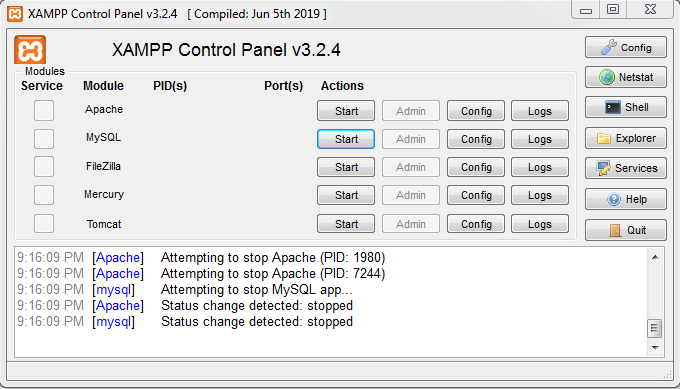
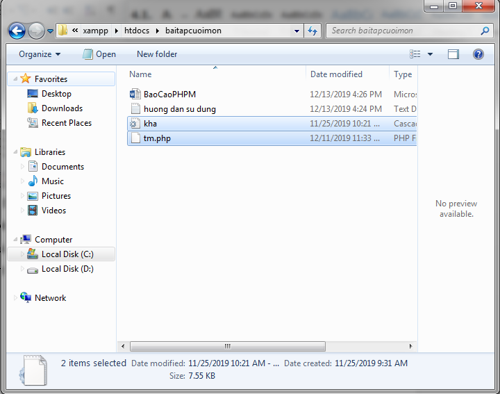
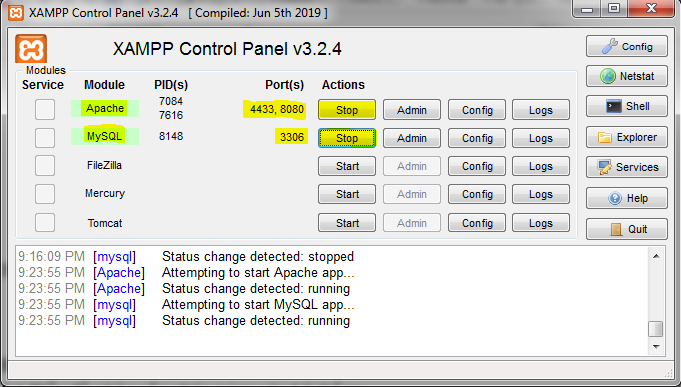
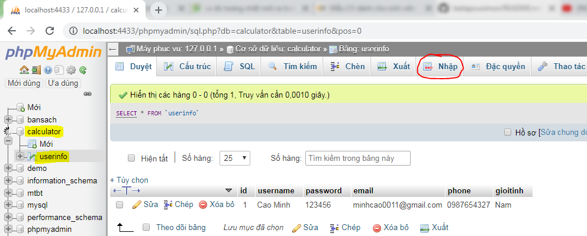
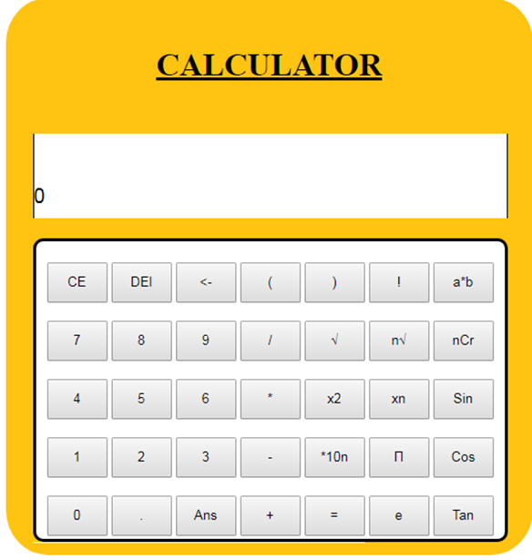

# CALCULATOR - ỨNG DỤNG WEB MÁY TÍNH BỎ TÚI MIỄN PHÍ

++++++++++++++++++++++++++++++++++++++++++++++++++++++++++++++++++++++++++++++

<h1>👉 Mô tả bài toán</h1>
<h3>📱 Công dụng</h3>

<h4> Công nghệ thông tin đang từng bước đi vào cuộc sống của chúng ta như một người bạn đồng hành, nó có vai trò rất lớn trong sự phát triển của đất nước và trong đời sống của con người. Xây dựng ứng dụng máy tính bỏ túi CALCULATOR để giúp ích cho nhu cầu tính toán của con người với tốc độ nhanh và chính xác.</h4>

 - Tính toán kết quả của các phép tính yêu cầu của người dùng từ cơ bản đến nâng cao. Hệ thống mới gồm các chức năng sau:

 + Nhập: Cho phép nhập các số trên bàn phím, các phép toán số học, các phương trình, các phép toán logic...vào trong máy tính.

 
 + Xử lý chức năng:

 
- Đăng ký, đăng nhập vào website khi sử dụng Máy tính.

- Các phép tính cơ bản như cộng (+), trừ (-), nhân (*), chia (/).

- Các phép tính nâng cao như: sin, cos, tan, mũ, giai thừa,..
    
- Các phép tính khó như: giải phương trình bậc 2, bậc 3; logic cho hàm mũ,...

- Đổi về số nhị phân để tính toán.

- Giải ma trận 2,3,4.

- Đổi độ C sang độ F và ngược lại.

 
 + Hiển thị:

 
 - Sau khi xử lý xong phép toán thì sẽ hiện kết quả của phép tính mà nó vừa xử lý xong lên màn hình ngay dòng kết quả. 
 
 - Hiển thị kết quả số nhị phân nếu sử dụng chức năng tính bằng số nhị phân.
 
- Lưu các kết quả gần nhất để tiện cho người sử dụng.
 
- Lưu kết quả của các tài khoản đăng nhập.
 
<h3>☝ Ứng dụng</h3>

 - Áp dụng cho các đa đối tượng từ các bạn học sinh sinh viên, đến các ngành nghê khác như: giáo viên, kinh doanh,...

 - Sự dụng cho các đối tượng cụ thể thuộc các môi trường cụ thể như trường học, môi trường doanh nghiệp,...

<h1>👉 Mục đích xây dựng bài toán</h1>
<h4>Chiếc máy tính bỏ túi là dụng cụ học tập quen thuộc đối với nhiều thế hệ học sinh - sinh viên. Ngoài một công cụ hỗ trợ đắc lực trong việc học tập và thi cử, máy tính còn được sử dụng rộng rãi trong các lĩnh vực khác như kinh doanh, tài chính và trong nhiều lĩnh vực chuyên môn khác. Một thiết bị đơn giản có thể thay thế bạn tính toán những phép tính đơn giản mà không cần dùng phương pháp truyền thống là viết ra giấy hay tính nhẩm. Máy tính giúp con người thực hiện được các phép tính chính xác và nhanh chóng hơn.</h4>
  <h3> Đầu vào/ đầu ra của bài toán</h3>
  
 + Input: 

  
- Tên tài khoản và Passwword của người dùng.
  
- Các toán hạng từ 0 đến 9

- Dấu phẩy thập phân.

-	Các toán tử cộng, trừ, nhân, chia.

-	Các toán tử sin, cos, căn bậc 2, bình phương.

-	Số nguyên a, b, c (cho chức năng giải phương trình).

-	Tác động Xóa.	

 + Output: 

- Chương trình.

-	Các toán hạng, số thập phân được nhập.

-	Kết quả các phép tính.

-	Nghiệm của phương trình.

-	Xóa màn hình máy tính hiện có (trả về 0).

<h3>	Hướng giải quyết bài toán</h3>

+ Thuật toán xử lý nhập các toán tử và toán hạng: Dùng phương thức POST để lấy các toán tử, toán hạng từ các Button ứng với nó.

+ Thuật toán xử lý các phép tính: dùng hàm eval hỗ trợ trong ngôn ngữ php.

<h1>⚙ Các bước cài đặt và công cụ hỗ trợ</h1>

- Bước 1: Clone Responsity này về máy của bạn.

-	Bước 2: Nếu bạn dùng Xampp cho máy.

Copy folder vừa clone về lưu vào thư mục mới trong htdocs của Xampp

-	Bước 3: Mở Xampp.

 Vào phpmyadmin trong localhost của bạn. Sau đó import mysqli vào CSDL của bạn để làm việc phần login và sigin.

-	Bước 4: Vào google của bạn nhập locallhost:8080/baitap/index.php

-- Trong đó:	8080 là PORT trong Xampp của bạn hiện mở.

-- tm.php : tên file lưu chương trình của bạn.)

	Nếu bạn muốn làm việc với code:

- Hãy inport mysql có tên Calculator.sql vào phần cơ sở dữ liệu của bạn và làm việc.

- Mở code download về trong htdots bằng Sublime Text 3 và thực hành.

<h1>📑 Nội dung bài toán</h1>

<h3>Đã hoàn thành</h3>

- Chương trình đã hoàn thành phần thiết kế giao diện.

- Giải quyết được một số chức năng cơ bản như: 

- Các phép tính cộng, trừ, nhân, chia.

- Các phép mũ, căn bậc 2, số pi, số e.

- Các hàm lượng giác sin, cos, tan.

- Lưu kết quả gần nhất.

- Xóa 1 số hay Xóa toàn màn hình (trả về 0).

- Giải phép toán nâng cao hơn như: 

- Giải phương trình bậc 2.

- Tính các phép n căn.

<h1>👉 Hướng phát triển cho bài toán</h1>

••	Xử lý ngoại lệ tất cả các trường hợp còn thiếu.

••	Cấu trúc lại toàn bộ code cho đồng bộ và thống nhất.

••	Xây dựng thêm các chức năng khác nâng cao như tính phân số, số phức, kiểm tra số nguyên tố,…

••	Thiết kế chức năng lưu kết quả trong 5 đến 10 lần gần nhất.

••	Thêm các chức năng giải phương trình các bậc 3; logic và cơ số mũ logic; giải ma trận mxn.

••	Cho phép nhập các số nhị phân và tính toán.

••	Chức năng đổi nhiệt độ (C sang F và ngược lại).

<h3>👦 Tác giả</h3>

- 👧🏼 Nguyễn Thị Tuyết Minh: Back End Developper (PHP, MySQL, JS)

- 👧 Hoàng Thị Mỹ Duyên: Front End Developper (HTML, CSS) 
